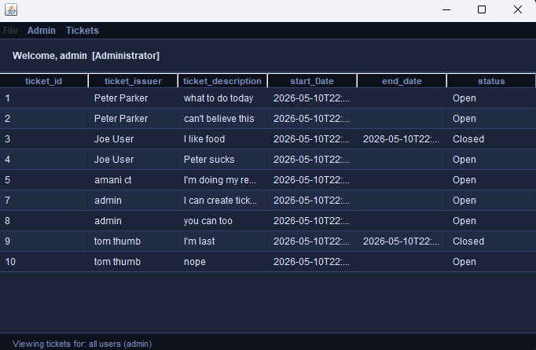
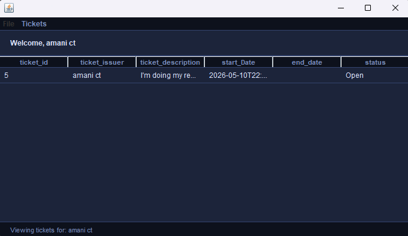

# Ticket Management System

A Java Swing desktop application for managing help desk tickets with role-based access and MySQL database integration.

Users can create and view their own tickets, while administrators can manage tickets across the system, including updating, closing, and deleting them.

## Features

- User authentication
- Admin and regular user roles
- Create and view support tickets
- Update, close, and delete tickets as an administrator
- Search for tickets by ID
- Persistent ticket and user data with MySQL
- Prepared statements for database operations
- Java Swing interface with custom styling

## Tech Stack

- Java
- Java Swing
- JDBC
- MySQL

## Screenshots

### Login

### Administrator Dashboard

### Regular User View

## Project Structure

- `Login.java` — authentication and login interface
- `Tickets.java` — ticket management interface and actions
- `Dao.java` — database connection and CRUD operations
- `TicketsJTable.java` — converts database results into table models
- `UIStyle.java` — shared Swing styling

## Running the Project

1. Install a Java JDK.
2. Add MySQL Connector/J to the project classpath.
3. Configure access to the MySQL database.
4. Run `Login.java`.

## About

Originally developed as a final project for ITMD 411.